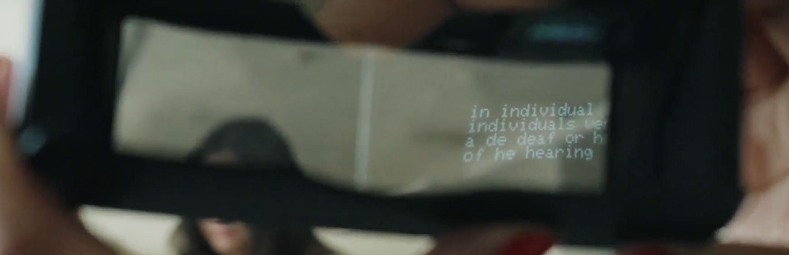
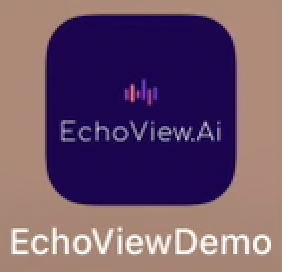
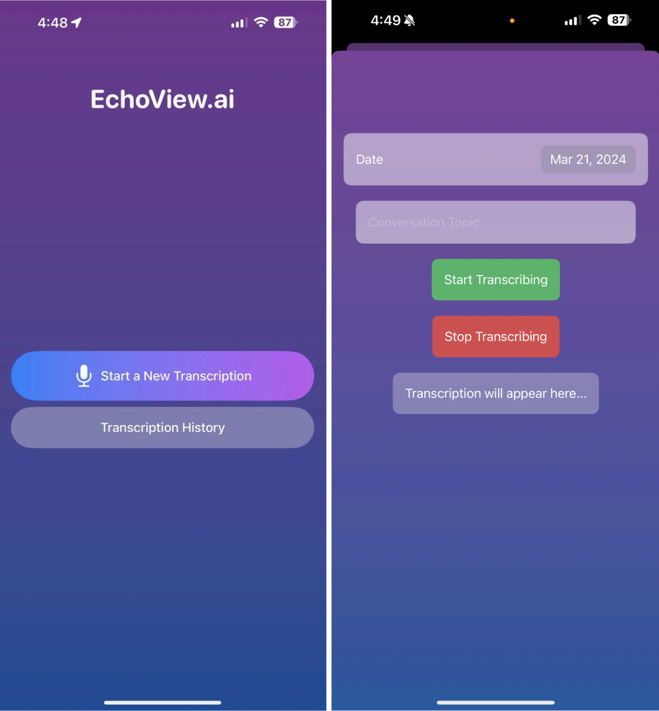
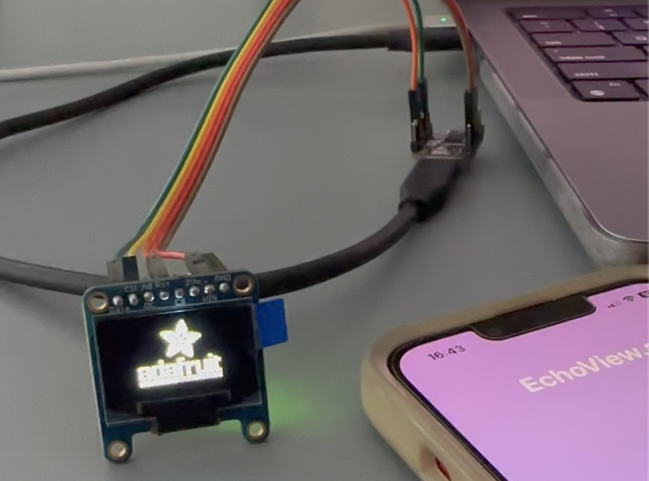
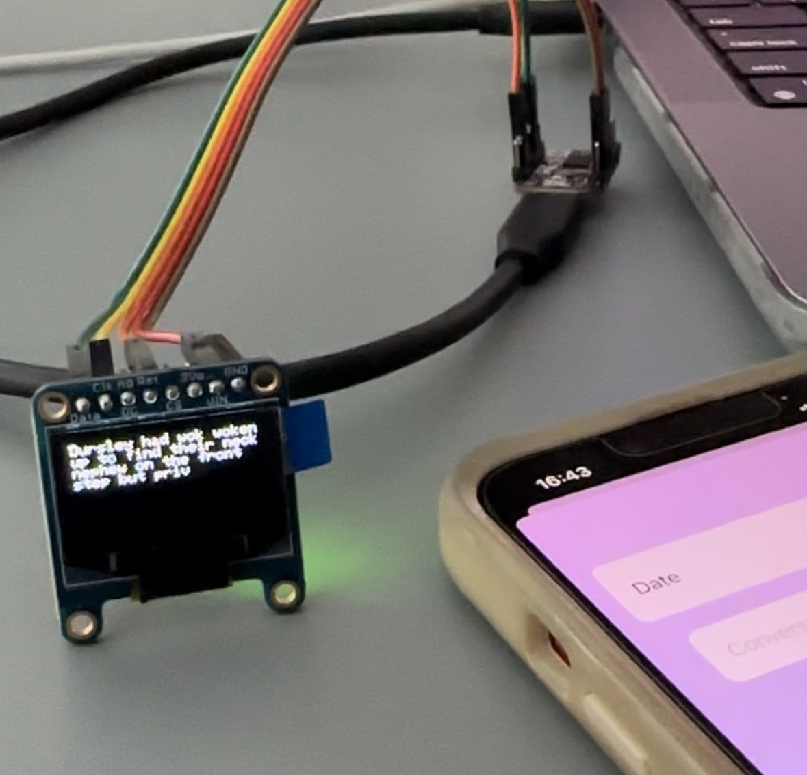
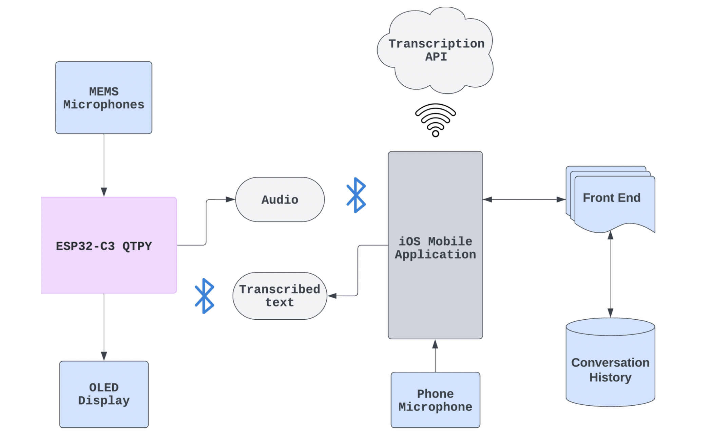

# README_SOFTWARE.md

## Overview

EchoView.AI is designed to enhance communication accessibility for the deaf and hard-of-hearing community through real-time speech-to-text transcription. This comprehensive software documentation covers both the iOS application and the embedded software on the ESP32-C3, providing detailed setup, dependencies, and operational guidelines necessary for deployment and development.



## Software Modules Overview
### **iOS Swift Application**

#### Overview
The iOS Swift application serves as the user interface for the EchoView.AI system, providing real-time speech transcription, Bluetooth management, and user settings customization. Developed using SwiftUI and Swift 5, the app leverages advanced iOS frameworks like CoreBluetooth for BLE communications and CoreData for data persistence.




#### Key Components
- ContentView.swift: The root view of the application, managing the main user interface elements and interactions.
- BluetoothManager.swift: Manages all Bluetooth-related operations, including scanning for devices, connecting, and data transmission.
- SpeechRecognizer.swift: Utilizes the iOS Speech framework to convert spoken language into text, managing both the audio session and speech recognition tasks.
- PersistenceController.swift: Handles all data persistence operations using CoreData, saving and retrieving transcription records.
- TranscriptionDetail.swift: Defines the data model for a transcription record, including attributes for storing date, text, and associated metadata.

#### Features
- Language/Frameworks: Developed in Swift 5 and SwiftUI for a native iOS experience.
- Main Features:
  - Bluetooth Low Energy (BLE): Manages communication with the ESP32-C3 microcontroller.
  - Transcription Display: Shows real-time transcriptions and manages transcription history.
  - Settings Customization: Allows users to customize text display settings such as size and color.

#### Operational Flow for iOS Swift Application
- Initialization:
  - Set up the main user interface.
  - Initialize core data stack for persistence.
  - Configure Bluetooth manager.
- Bluetooth Operations:
  - Scan for available BLE devices.
  - Connect to the ESP32 device.
  - Handle BLE state changes and errors.
- Transcription Management:
  - Start transcription service when user initiates.
  - Process incoming audio and convert it to text.
  - Display real-time transcription on the UI.
- Data Handling:
  - Store transcriptions in CoreData for historical access.
  - Allow users to review and manage past transcriptions.
- User Interaction:
  - Provide settings for users to customize text appearance.
  - Handle user inputs for starting/stopping transcription.
  - Navigate through different views via the navigation stack.
- Background Operations:
  - Manage app state changes (background to foreground).
  - Maintain active BLE connections and data transfer.
- Termination:
  - Properly disconnect from BLE device.
  - Save all unsaved data before app closes.
  - Clean up resources to prevent memory leaks.
---
### Embedded Software on ESP32-C3

#### Features
- Language/Platform: Implemented in C++ using the Arduino development environment.
- Main Features:
  - BLE Communication Handling: Manages BLE operations including device pairing and data transmission.
  - Audio Input Management: Captures and processes audio input from MEMS microphones.
  - Data Processing: Converts audio signals into formatted text to be sent back to the iOS application.

#### Overview
The firmware for the ESP32 microcontroller manages the Bluetooth Low Energy (BLE) communications and the OLED display to show text received from the iOS application. It is developed using the Arduino platform and utilizes the Adafruit_GFX and Adafruit_SSD1306 libraries for display operations and the BLEDevice library for BLE functionality.

#### Key Components
- echoview_esp32_v1.ino: This is the main file of the ESP32 firmware. It includes the setup and loop functions where the BLE server is configured, and the OLED display is managed.

#### Details
- BLE Setup: The firmware initializes a BLE server, advertises services, and handles connections and disconnections. It defines custom service and characteristic UUIDs to facilitate communication with the iOS application.
- OLED Display Management: Using the Adafruit_SSD1306 library, the firmware controls an OLED display to show text messages received over BLE. The text display supports basic scrolling when messages exceed the display area.
- Data Handling: Implements a callback mechanism to receive and process text data sent from the connected BLE device. The text is then displayed on the OLED screen and optionally echoed back to confirm receipt.

#### Functions
- addText(String text): Adds text to the display, managing line breaks and scrolling.
- MyServerCallbacks: Handles events for BLE server connections and disconnections.
- MyCallbacks: Processes write operations on the BLE characteristic, updating the display with received text.

#### Operational Flow
- Initialization:
  - Start Serial communication.
  - Initialize BLE server and services.
  - Set up OLED display.
- BLE Operations:
  - Advertise BLE service and characteristics.
  - Handle BLE connections and disconnections.
  - React to data written to input characteristics.
- Display Management:
  - Receive text via BLE.
  - Check if new text exceeds the display area.
  - Scroll display if necessary or append new text.
  - Update OLED display to show new text.
- Continuous Operation:
  - Maintain BLE availability.
  - Keep listening for incoming BLE connections and data.
  - Refresh OLED display based on received data.
- Handling Disconnections:
  - Automatically restart advertising to allow reconnection.
  - Clear display or display a status message.
---
### **OLED Display Management**

#### Overview
The OLED display management is implemented using a Python script running on a device equipped with an I2C interface, such as an ESP32 or Raspberry Pi. This script uses the Adafruit_SSD1306 library to control an OLED display and display text data dynamically. It is designed to handle streaming output from a subprocess, which can be customized for various use cases such as displaying real-time speech to text transcriptions.




#### Key Components
- echoviewai_v.0.1.py: The main Python script that initializes the OLED display, processes incoming text, and updates the display in real-time.

#### Details
- Initialization: Sets up the I2C interface and initializes the OLED display using specific dimensions and address.
- Text Display Management: Uses the Python Imaging Library (PIL) to create an image buffer where text is drawn. The script wraps text to fit the OLED display's width and updates the display with new text as it arrives.
- Subprocess Management: Starts a subprocess that is intended to continuously provide output text, which is read line by line and displayed on the OLED.

#### Functions
- update_display(text): A function that clears the current display, wraps the incoming text based on the display's width, and updates the OLED screen to show the new text.

#### Operational Flow
The following flow chart illustrates the operational logic from subprocess initiation to display updating:
- Initialization:
  - Initialize I2C interface.
  - Set up OLED display with Adafruit_SSD1306.
- Script Execution:
  - Start a subprocess to stream output.
- Display Update Process:
  - Read output from the subprocess line by line.
  - Clear display.
  - Wrap text to fit display width.
  - Update display with new text.
- Continual Update:
  - Loop through the subprocess output.
  - Handle each line of text in real-time.
  - Refresh the OLED display with each new line.
- End Process:
  - Close subprocess.
  - Clear display on script termination.

## Flow Chart
The following flow chart illustrates the interaction between the iOS application, the ESP32-C3 microcontroller, and the OLED Display:



## Dependencies and Build Tools

### iOS Application
- **Xcode 12 or later**: Essential for iOS app development.
- **Swift 5**: Programming language.
- **CocoaPods**: Dependency manager used to install and manage third-party libraries.
  - **CocoaPods Libraries**: List specific libraries and versions.
  
### ESP32-C3 Software
- **Arduino IDE**: Used for developing and uploading C++ code to the ESP32.
- **ESP32 Board Definitions**: Must be added to the Arduino IDE for ESP32 support.
- **Adafruit SSD1306 Library**: For OLED display operations.
- **Additional Libraries**: Specify other libraries and their versions.

## Setup and Installation Instructions

### iOS Application Setup
1. **Clone the repository:**
   ```bash
   git clone https://github.com/nckhrdy/EchoView.ai.git
   ```
2. **Install dependencies:**
   ```bash
   cd EchoView.ai/App/ios
   pod install
   ```
3. **Open the .xcworkspace file in Xcode:**
   ```bash
   cd EchoView.ai.xcworkspace
   cd project.xcworkspace
   ```
4. **Build and run the application on a compatible iOS device.**

### ESP32-C3 Firmware Setup
1. **Install the Arduino IDE and ESP32 Board definitions.**
2. **Go into Folder where the firmware / ESP32 software is located:**
   ```bash
   cd Device
   ```
3. **Open the file (echoview_esp32_v1.ino) in Arduino IDE**
4. **Connect the ESP32-C3 via USB and select the correct port in Arduino IDE.**
5. **Compile and upload the software to the ESP32-C3**

## Build and Deployment

### iOS Application
- Use Xcode to build and deploy the application on an iOS device
- Ensure the device's Bluetooth is turned on and pair it with ESP32-C3

### ESP32-C3
- The ESP32-C3 auto-starts the software upon boot
- Make sure it is powered and in range of the iOS device for initial BLE pairing
- Compile the firmware in the Arduino IDE.
- Use the 'Upload' button to flash the compiled binary directly to the connected ESP32 device

## Hardware and Software Interface

### Bluetooth Interface
- Manages connectivity between the iOS device and ESP32-C3

### Audio Data Management
- Real-time audio data capture and processing on ESP32-C3


## Future Developments

### Cross-Platform Compatibility and Language Support

As EchoView.AI evolves, we plan to enhance its accessibility and functionality by leveraging Hugging Face's Large Language Models (LLMs). These advancements are aimed at making the application compatible across both Android and iOS platforms, thereby reaching a broader user base. By integrating LLMs, we expect to introduce a variety of smart features, including:

- **Multilingual Support**: Expanding the application's language capabilities to include multiple languages, which will allow users from different linguistic backgrounds to benefit from our service.
- **Enhanced Contextual Understanding**: Utilizing the advanced natural language processing (NLP) capabilities of LLMs to improve the transcription accuracy and context awareness of the speech-to-text engine.
- **Smart Interaction Features**: Developing features that enable more interactive and responsive communication aids, such as real-time suggestions and automated responses based on the context of the conversation.

### Integration Goals

- **Android Compatibility**: Adapt the existing iOS-based application to also function seamlessly on Android devices, ensuring a uniform user experience across different mobile platforms.
- **User Interface Adaptation**: Redesign the user interface to accommodate additional features while maintaining ease of use and accessibility.

These future developments are intended to not only extend the reach of EchoView.AI but also to enhance the overall user experience by incorporating cutting-edge AI technologies. Our goal is to create a universally accessible tool that aids communication for the deaf and hard-of-hearing community in a variety of scenarios and languages.